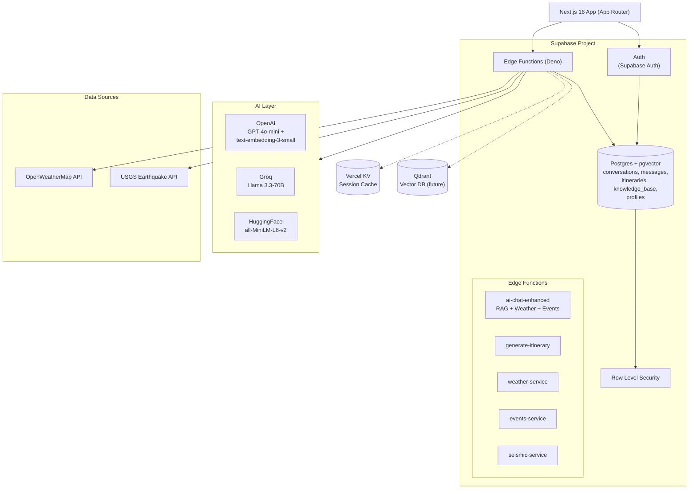

# Costa Rica Now

AI-powered travel companion for Costa Rica — real-time weather, events, seismic monitoring, and a multilingual AI travel assistant.

<p align="center">
  
  <br>
  <em>Demo GIF coming soon.</em>
</p>

## Tech Stack


-DC382D?logo=redis&logoColor=white)

-FF6F00?logo=localizacion&logoColor=white)

## Architecture



## Features

- **AI Travel Assistant** — RAG-powered chatbot with knowledge base, weather, and events context. Uses vector search (pgvector) with text-search fallback.
- **Real-time Weather** — Current conditions and forecasts for major Costa Rica destinations.
- **Events & Activities** — Curated events with weather-dependent filtering and location context.
- **Seismic Monitor** — Live earthquake data from USGS with Costa Rica–specific filtering.
- **News** — Costa Rica travel news feed.
- **Itinerary Generator** — AI-powered personalized day-by-day itineraries (auth required).
- **Bilingual** — Full Spanish and English support via next-intl.
- **Progressive Auth** — Browse freely, authenticate only for premium features (itineraries, conversation history, memory).

## Getting Started

```bash
npm install
npm run dev
```

The development server starts at `https://localhost:3000` with HTTPS (required for Supabase Auth).

### Environment Variables

| Variable | Description |
|---|---|
| `NEXT_PUBLIC_SUPABASE_URL` | Supabase project URL |
| `NEXT_PUBLIC_SUPABASE_PUBLISHABLE_KEY` | Supabase anon/publishable key |
| `SUPABASE_SERVICE_ROLE_KEY` | Service role key (server-side only) |
| `OPENAI_API_KEY` | OpenAI API key |
| `GROQ_API_KEY` | Groq API key (free tier AI) |
| `HF_API_KEY` | HuggingFace API key |
| `OPENWEATHERMAP_API_KEY` | OpenWeatherMap API key |
| `KV_URL` / `KV_REST_API_URL` | Vercel KV connection strings |
| `NEXT_PUBLIC_GOOGLE_MAPS_API_KEY` | Google Maps API key |
| `GOOGLE_OAUTH_CLIENT_ID` | Google OAuth client ID |

## Design Decisions

### 1. RAG over Fine-tuning

The chatbot uses **Retrieval-Augmented Generation** with pgvector embeddings rather than fine-tuning. This lets us update Costa Rica travel knowledge (new hotels, changing regulations, seasonal events) by adding documents to the `knowledge_base` table — no model retraining needed. A 3-tier search strategy (vector → text → general fallback) ensures graceful degradation.

### 2. Dual AI Provider Architecture

Both **OpenAI** (GPT-4o-mini) and **Groq** (Llama 3.3-70B) are supported via a provider abstraction. The `AI_PROVIDER` environment flag switches between them. This guards against vendor lock-in and lets us serve free-tier users via Groq while using OpenAI for premium features.

### 3. Progressive Authentication

The app uses a **soft auth gate** — the home page and travel assistant are fully accessible without login. Authentication is only required for data-persisting features (itinerary saving, conversation history, memories). API enforcement happens at the Edge Function layer via JWT validation, not through Next.js middleware. This keeps public pages fast (no auth checks on every request) while protecting user data server-side.

### 4. Edge Functions over API Routes

Supabase Edge Functions (Deno) handle all AI, weather, events, and seismic logic instead of Next.js API routes. This keeps AI processing (which can be slow) off the Next.js server, avoids blocking the Node.js event loop, and lets the AI services scale independently. The `_shared/` directory provides cross-function utilities (CORS, auth, embeddings, completions).

### 5. Vector Search with Fallbacks

The knowledge base is embedded with `text-embedding-3-small` (1536 dimensions) and searched via pgvector's cosine distance. If vector search fails (e.g., embedding API outage), the system falls back to PostgreSQL `ilike` text matching, then to recent general content. This ensures the assistant always has context to answer from.

### 6. Schema-as-Code

Database schemas live in `supabase/tables/` as raw SQL, versioned alongside the application code. Migrations in `supabase/migrations/` are timestamped and include the RLS policies, vector extension setup, and the `search_knowledge` function. This keeps the database definition auditable and reproducible.

### 7. Internationalization First

`next-intl` with file-based messaging is baked in from the start (not retrofitted). All UI strings, dates, and number formats are locale-aware. The default locale is Spanish (`es`), reflecting the primary audience.

## Project Structure

```
src/
├── app/[locale]/
│   ├── (pages)/
│   │   ├── auth/        # Sign in / sign up / callback
│   │   ├── news/        # Travel news
│   │   ├── seismic/     # Earthquake monitor
│   │   └── weather/     # Weather dashboard
│   ├── layout.tsx       # Root layout (providers, header, footer)
│   └── page.tsx         # Home page (chat interface)
├── components/
│   ├── ui/              # shadcn/ui primitives
│   ├── ChatInterface.tsx
│   ├── WeatherDisplay.tsx
│   ├── EventsDisplay.tsx
│   └── ...
├── providers/           # React context providers
├── config/              # Centralized app config
├── hooks/               # Custom React hooks
├── i18n/                # next-intl setup
├── lib/                 # Utilities (cn, etc.)
└── utils/supabase/      # Client + server supabase helpers

supabase/
├── functions/           # Deno edge functions
│   ├── ai-chat-enhanced/
│   ├── generate-itinerary/
│   ├── weather-service/
│   ├── events-service/
│   ├── seismic-service/
│   └── _shared/         # Shared utilities
├── tables/              # SQL table definitions
└── migrations/          # Timestamped migrations
```

## Scripts

| Command | Description |
|---|---|
| `npm run dev` | Start dev server with HTTPS |
| `npm run build` | Production build |
| `npm run lint` | ESLint check (zero warnings) |
| `npm run tscheck` | TypeScript type check |
| `npm run changelog` | Generate changelog |

## License

MIT
